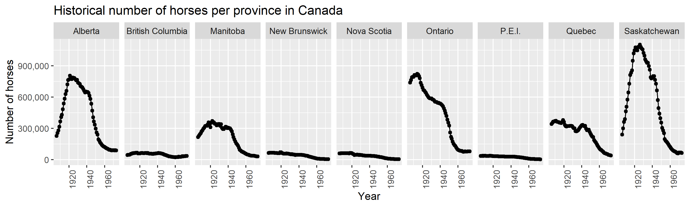
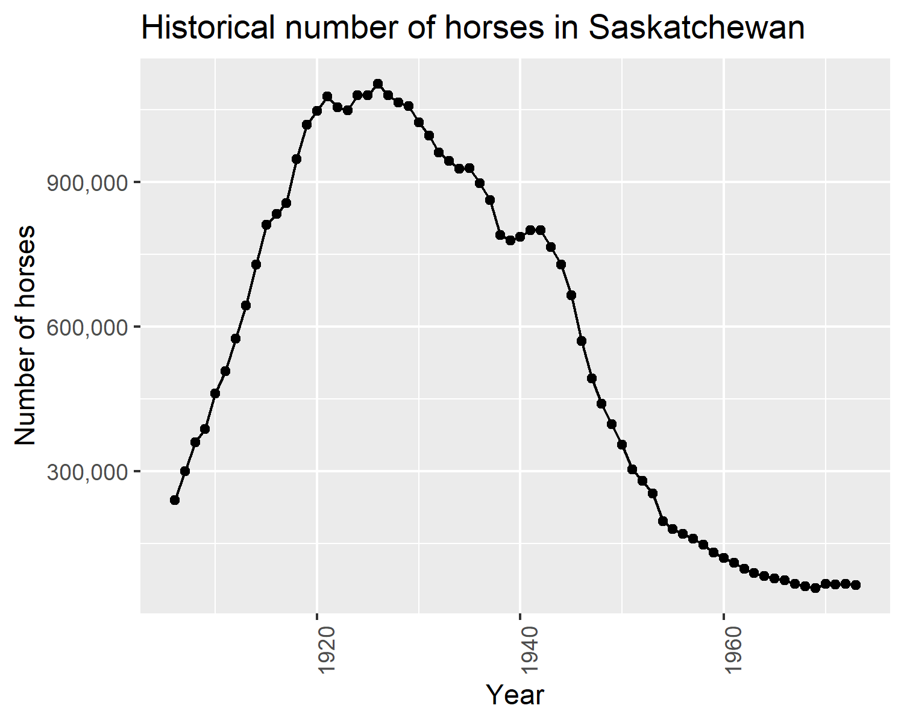

```{r include=FALSE}
library(tidyverse)
```

# Aim

This project explores the historical population of horses in Canada between 1906 and 1972 for each province.

# Data

Horse population data were sourced from the [Government of Canada's Open Data website](http://open.canada.ca/en/open-data) [@horses1; @horses2].

# Methods

The R programming language [@R] and the following R packages were used to perform the analysis: knitr [@knitr], tidyverse [@tidyverse], and bookdown [@bookdown]. *Note: this report is adapted from [@ttimbers-horses].*

# Results

```{r horse-pops-plot, out.height="70%", out.width="100%", fig.cap="Horse populations for all provinces in Canada from 1906 - 1972", echo=FALSE, message=FALSE}

```


Suppose we were interested in looking in more closely at the province with the highest spread (in terms of standard deviation) of horse populations. We present the standard deviations here:

```{r horses-sd, echo=FALSE, message=FALSE}
horses_sd_table <- read_csv("../../results/horses_sd.csv")
largest_sd <- horses_sd_table$Province[1]
knitr::kable(horses_sd_table, caption="Standard Deviation of the Number of Horses by Province")
```

Note that we define standard deviation (of a sample) as

$$s = sqrt( sum_{i = 1}^n(x_i - \bar{x}) / (n-1))$$

Additionally, note that in Table \@ref(tab:horses-sd) we consider the sample standard deviation of the number of horses during the same time span as Figure \@ref(fig:horse-pops-plot).

```{r horse-pop-plot-largest-sd, fig.align="center", out.height="60%", out.width="60%", fig.cap="Horse populations for the province with the largest standard deviation", echo=FALSE}

```


In Figure \@ref(fig:horse-pop-plot-largest-sd) we zoom in and look at the province of `r largest_sd`, which had the largest spread of values in terms of standard deviation.


# References